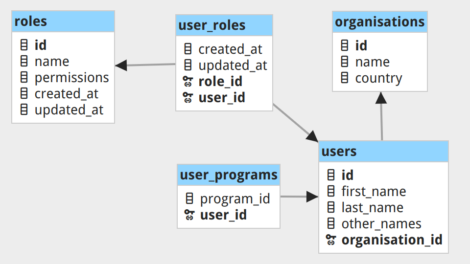

# User Roles

## Overview

The roles are used to define the permissions of the users. Users can be assigned multiple roles, based on the permissions they need. If a user has multiple roles, the permissions of all the roles are combined as a union.

Roles are defined at the organisation level. An organisation can have has its own set of roles.




## Endpoints

> `GET /api/roles`

Returns the list of the organisation's roles.
```json
{
    "data": [
        {
            "id": 1,
            "name": "Admin",
            "permissions": [
                { "module": ["...permissions"] },
                { "acm_tbloader": ["can-create-deployment", "can-update-playlist"] }
            ]
        }
    ]
}
```

> `POST /api/roles`

Creates a new role for the organi   sation.

> `DELETE /api/roles/:id`

Deletes the role with the given id.

> `POST /api/roles/assign`

Assigns a role(s) to a user.
